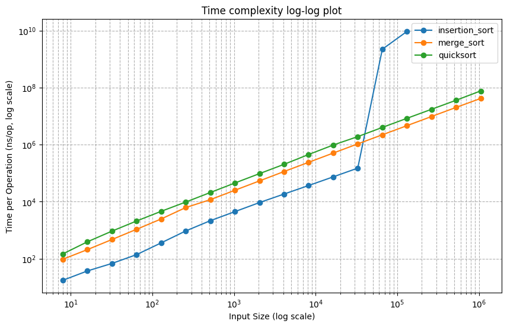

# sorting

Implemention and benchmark of sorting algorithms in Go.

## Result

Sorting an integer array with random numbers chosen from the range [0, n). Graph was generated on my Macbook Air M1. 

